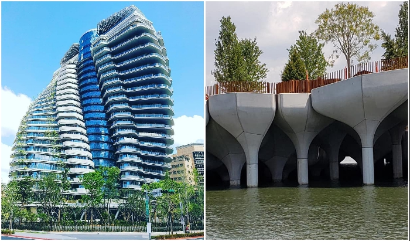
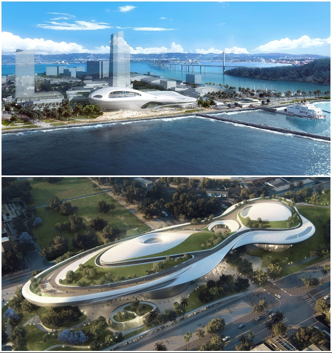
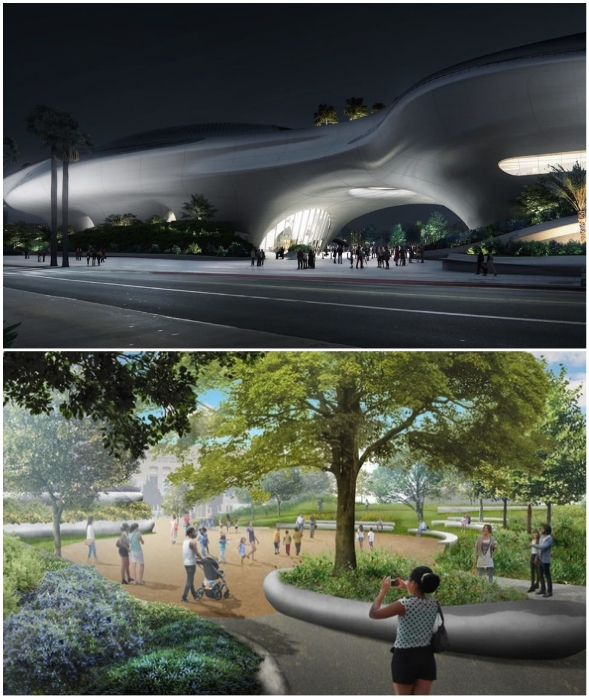
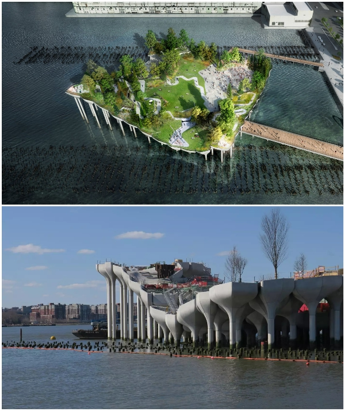
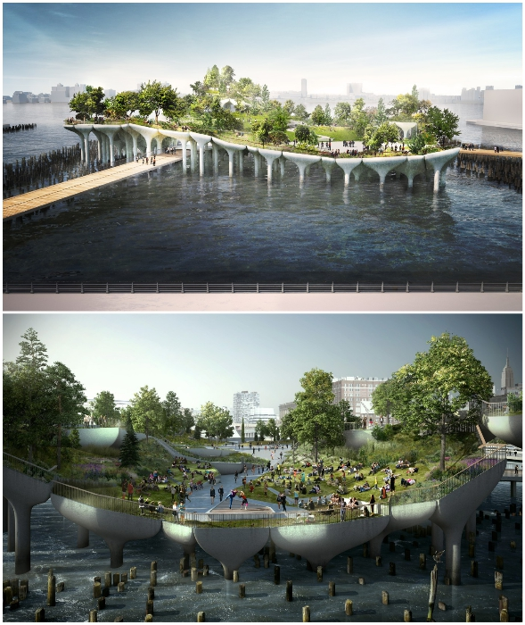

# Two grand architectural projects to be completed in 2021

The pandemic has put active life on hold all over the planet. Especially construction has been affected, which easily turns into long construction or "abandonment" if the technological processes are not maintained in a timely manner. Fortunately, the most impressive objects, which are eagerly awaited for delivery, do not face a similar fate, and they will still be able to surprise the world by the end of 2021, not only with their futuristic forms, but also with their unique possibilities.

## Museum of Narrative Art in Los Angeles (USA)

This project can rightly be considered the most unlucky concept, which has "survived" several times not only a complete transformation during the development phase, but also a change of location. Since 2014, the Lucas Museum of Narrative Art, designed by specialists of the famous architectural firm of China - MAD Architects for Chicago, tried to implement the project with San Francisco as well. But it never came to fruition.

In the first case, the environmental activists raised an incredible wave of protests, and in the second city, the authorities have been weighing the pros and cons for a very long time. In the meantime, Los Angeles had prepared a site in Exhibition Park near the University of Southern California and seized the initiative, because George Lucas, the legendary director of the Star Wars film saga and initiator of the construction, had studied there. Thanks to this, the dream of the famous film director, who had to completely change the concept in order to attract attention to his creation, will soon come true.

"I'm a fan of architecture, and I wanted a museum that was a work of art in itself. And Ma Jansung (head of the IAD bureau) made it so," says the director himself, hoping that his personal $1.5 billion will not be wasted. Although, according to Novate.ru editorial information, the announced opening of the "spaceship" is likely to take place at the beginning of next year.

## Landscape park over the water Little Island in New York (USA)

British architecture firm Heatherwick Studio is finishing up its project called Little Island. Soon, instead of the ruined old pier in New York City, it will be possible to enjoy a stroll through a landscaped park located above the waters of the Hudson River.

What makes this project unique is that the structure of the artificial island consists of a repeating pattern of 280 concrete piles that support giant platforms. As the modules are installed at different heights, an undulating landscape is created, planted with over a hundred different species of plants. The biodesign uses only native trees, shrubs and flowers that are perfectly adapted to the climate. In addition to the lush greenery, the park will be used as a public space with walking paths, seating areas, viewing platforms, an outdoor theater, and art platforms.

